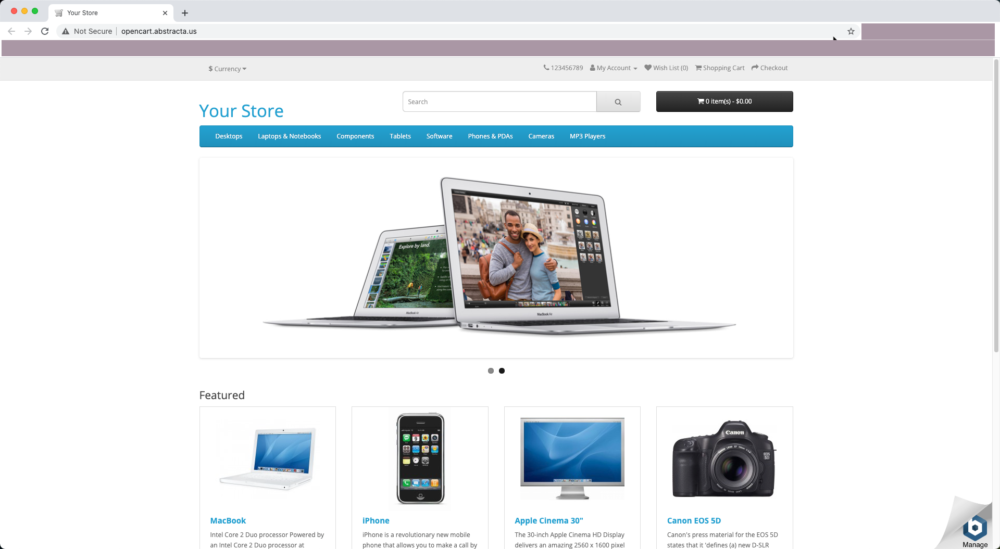

# Store - Web Automation

## Table of contents

* [About the project](#about-the-project)
* [Demo](#demo)
* [Built with](#built-with)
* [Getting started](#getting-started)
    - [Prerequisites](#prerequisites)
    - [Installation](#installation)
* [Usage](#usage)

## About The Project

This project is about the automation of a web page, in the first instance to ensure its correct operation and later to
be automated in other lenguages like Java and using other kind of tools.

## Demo

If you want to see the web site of this project, you can visit [Your Store](http://opencart.abstracta.us/).

## Built With

This automation project is created with:

* Programming Lenguage: Python
* Selenium WebDriver
* Page Object Model

## Getting started

## Prerequisites

In order to get the project locally to run the tests you need to have installed:

* Python installed
* IDE (VS Code, Pycharm, Eclipse, IntelliJ, etc)

## Installation

This example will be done with **Eclipse**.

1. Open Eclipse IDE.

2. Open the "Git Repositories" view. Window > Show view > Other > Git Repositories.

3. Select this option: **Clone a Git Repository and add the clone to this view**.

4. Add "http://gitlab.avantica.avanticatec.net/melvin.sandoval/tfgtec-auto.git " on URL field, next and finish.

5. Move to Java view.

6. Right click and select "import" > Projects from Git > Existing local repository > select the TFGTEC project.

Once you have installed everything you should view something like this:

## Usage

Once project is added on your local repository, follow this steps to run the tests.

1. Find config.json file.

2. Right click and Run as TestNG Suite.